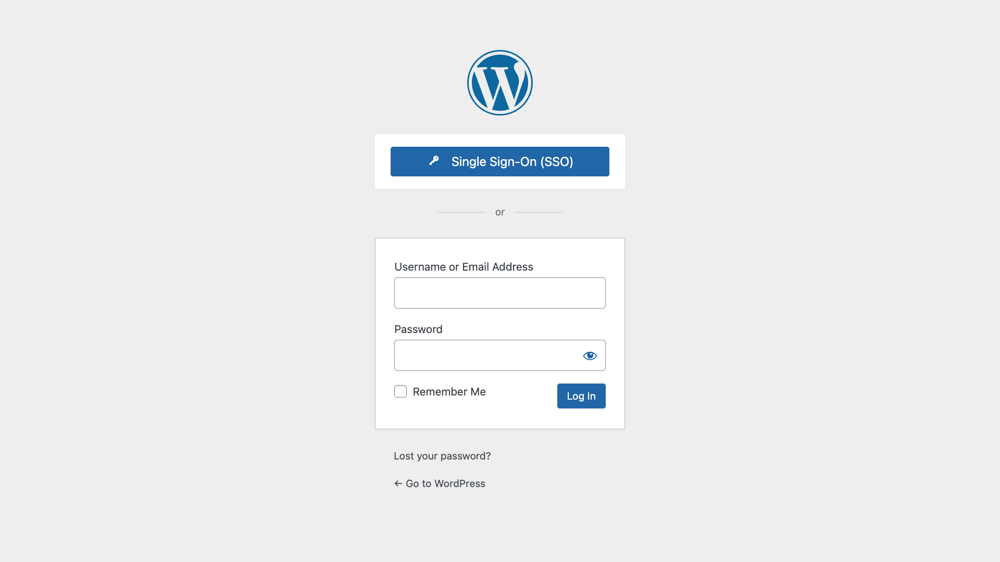
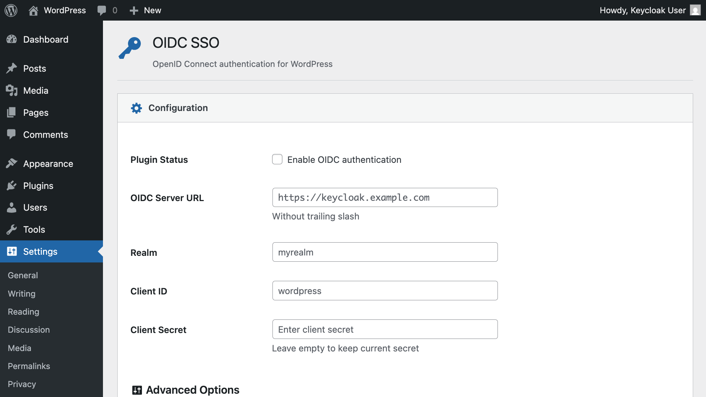
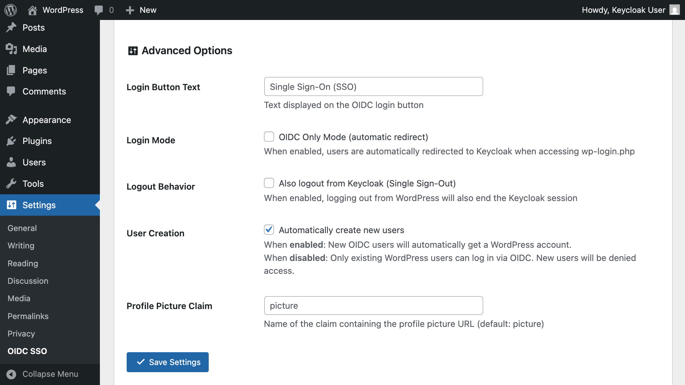
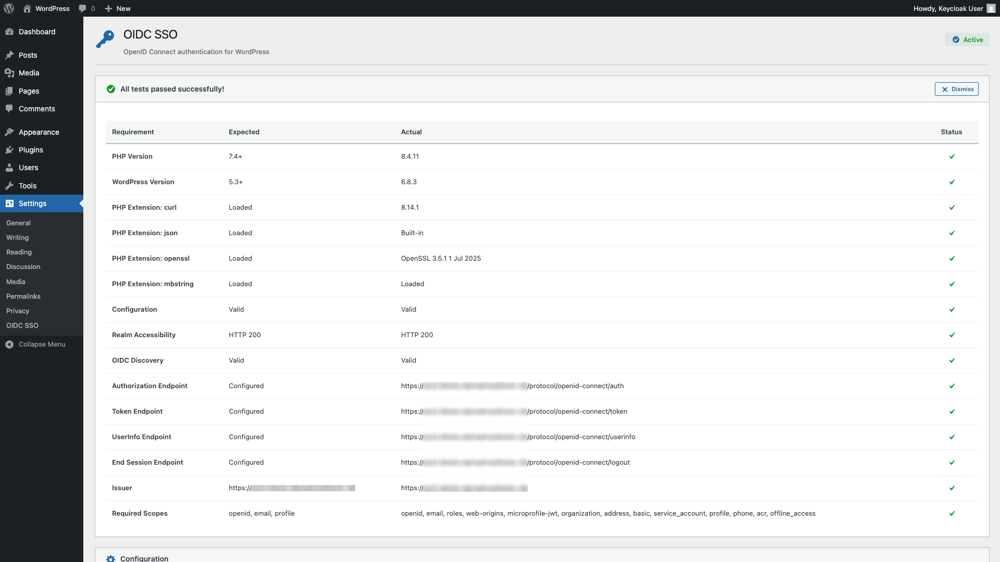
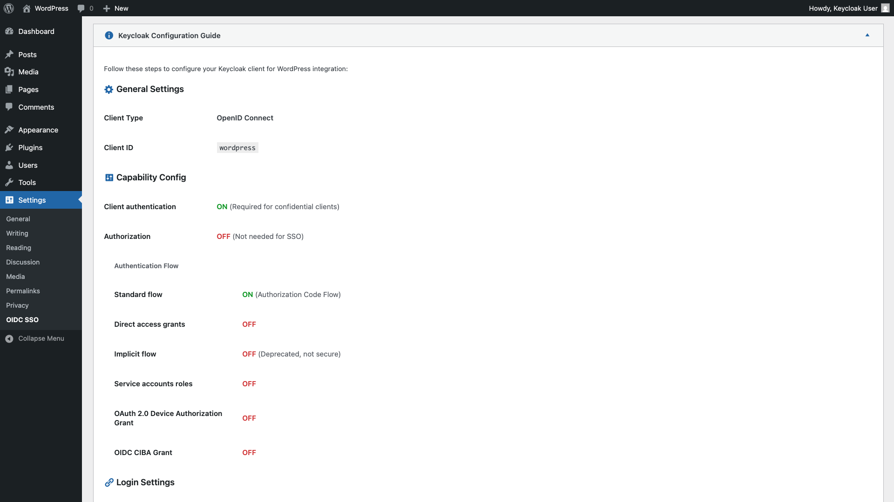

# Simple OIDC SSO

Lightweight WordPress plugin for quick and easy Keycloak authentication via OpenID Connect.

## Requirements

- WordPress 5.3+
- PHP 7.4+
- Keycloak 26+
- HTTPS (production)

## Installation

1. Upload plugin to WordPress
2. Activate plugin
3. Go to Settings → OIDC SSO
4. Enter your Keycloak settings:
   - Server URL (e.g., `https://keycloak.example.com`)
   - Realm name
   - Client ID
   - Client Secret
5. Save settings
6. Enable the plugin checkbox
7. Save again

## Keycloak Configuration Guide

1. Create new client in Keycloak
2. Set client protocol to `openid-connect`
3. Set Access Type to `confidential`
4. Add Valid Redirect URIs:
   - `https://your-wоrdpress-site.com/wp-login.php`
   - `https://your-wоrdpress-site.com/wp-login.php?*`
5. Add Valid Post Logout Redirect URI (for automatic logout):
   - `https://your-wоrdpress-site.com`
   - `https://your-wоrdpress-site.com/*`
6. **For profile picture sync**: Enable the `picture` claim in your client scope
7. **For name sync**: Ensure `profile` scope includes `given_name`, `family_name`, and `name` claims
8. Save and copy Client Secret

## Features

- ✅ OpenID Connect authentication
- ✅ Automatic user creation and profile sync
- ✅ Profile picture sync from Keycloak
- ✅ First name & last name sync from Keycloak
- ✅ Simple admin interface
- ✅ Enable/disable toggle
- ✅ Configurable logout behavior (WordPress only OR WordPress + Keycloak)
- ✅ Backchannel logout support (server-to-server logout notifications)
- ✅ Secure token handling
- ✅ Full WordPress Multisite support
  - Network-wide configuration
  - Site-specific overrides
  - Network-wide user access option

## Security

- State and nonce validation
- Secure token exchange
- Input sanitization
- HTTPS required for production

## Screenshots

### WordPress Login Page

*WordPress login page with the Single Sign-On (SSO) button*

### Plugin Settings - Basic Configuration

*Configure your Keycloak server, realm, and client credentials*

### Plugin Settings - Advanced Options

*Configure logout behavior, user creation, and profile picture sync*

### Connection Test Results

*Test your Keycloak connection and validate OIDC configuration*

### Keycloak Client Configuration Guide

*Built-in guide for configuring your Keycloak client*

## Usage

### Login
Once configured and enabled:
1. Go to WordPress login page
2. Click "Single Sign-On (SSO)"
3. Log in with Keycloak credentials
4. Redirected back to WordPress logged in

**Automatic Profile Sync:**
- First name, last name, and display name are synced from Keycloak on every login
- Profile picture is automatically downloaded and displayed in WordPress (admin bar, comments, etc.)
- Changes in Keycloak are reflected in WordPress after next login

### Logout Options
You can choose between two logout behaviors:

**Option 1: WordPress Only (Default)**
- Unchecked: "Also logout from Keycloak..."
- Logout only from WordPress
- Keycloak session remains active
- User stays logged in to other apps using the same Keycloak

**Option 2: WordPress + Keycloak (Single Sign-Out)**
- Checked: "Also logout from Keycloak..."
- Logout from both WordPress AND Keycloak
- Terminates Keycloak session completely
- User is logged out from all connected applications

### Backchannel Logout

The plugin supports Keycloak's backchannel logout feature, which allows Keycloak to notify WordPress when a user logs out from another application. This ensures automatic logout synchronization across all connected applications.

To enable backchannel logout in Keycloak:
1. Go to your client settings in Keycloak
2. Scroll to **Logout settings**
3. Turn **OFF** "Front channel logout" (required in Keycloak 26+)
4. Set **Backchannel logout URL** to: `https://your-wordpress-site.com/wp-json/simple-oidc/v1/backchannel-logout`
5. Turn **ON** "Backchannel logout session required"
6. Turn **ON** "Backchannel logout revoke offline sessions"

This is the recommended logout method as it's more reliable than frontchannel logout (no browser dependencies or CSP issues).

## Multisite Support

This plugin fully supports WordPress Multisite installations:

- **Network Admin Settings**: Configure once for all sites
- **Site Overrides**: Individual sites can customize settings
- **Network-wide Users**: Option to add users to all sites automatically
- **Flexible Configuration**: Mix network settings with site-specific configurations

## Contributing

Contributions are welcome! Please feel free to submit a Pull Request.

---

This project is not affiliated with <a href="https://keycloak.org">Keycloak</a> and/or <a href="https://wordpress.org">WordPress</a>. All mentioned trademarks are the property of their respective owners.
